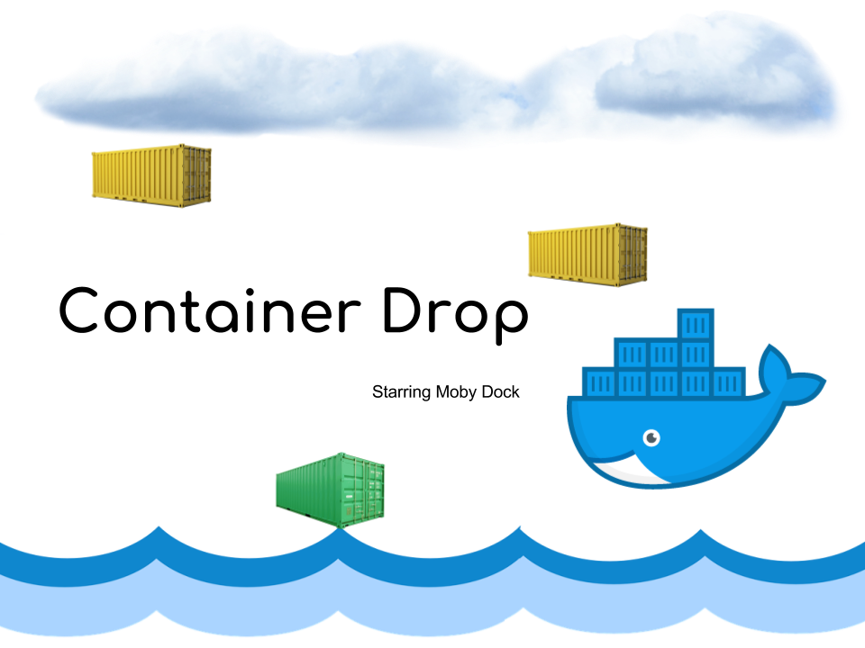

# container-drop

Containers are raining from the clouds! Help Moby Dock catch them all.

# Start the Game

docker run --rm -e DISPLAY=$DISPLAY -v /tmp/.X11-unix:/tmp/.X11-unix thshaw/container_drop:v1

# Build the Container and start

docker build -t container_drop:v1 .

docker run --rm -e DISPLAY=$DISPLAY -v /tmp/.X11-unix:/tmp/.X11-unix container_drop:v1

# Background

This game was built using Scratch.mit.edu and this [tutorial](http://coweb.cc.gatech.edu/ice-gt/uploads/446/SimpleWitchGame-6-4-2009.ppt)  It is fairly basic but a nice starting point for beginners.  

When you have a game created you can convert it from a .sb file into a Java jar file. Instructions are [here](https://wiki.scratch.mit.edu/wiki/Porting_Scratch_Projects#SB_to_JAR_.28Java_executable.29)

When you have the .jar file simply stick it in a container and share it around. The Dockerfile is available [here](./Dockerfile).

@tomwillfixit #DockerCaptain
